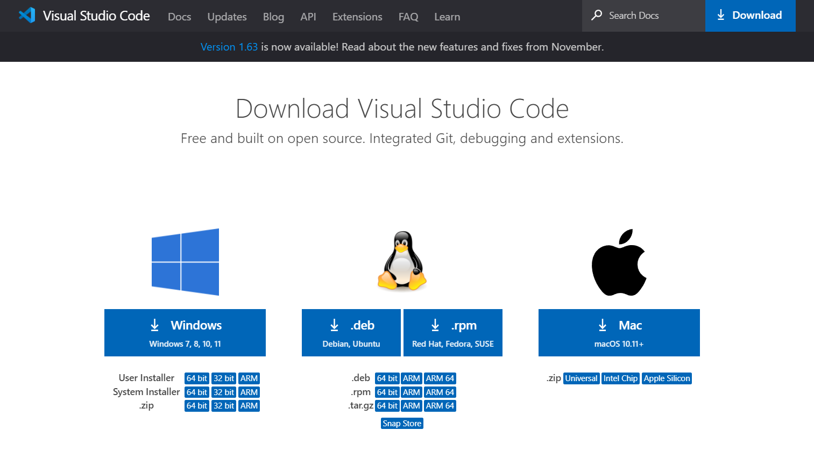
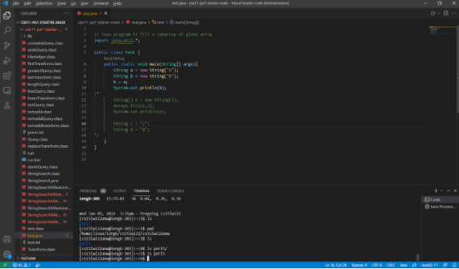
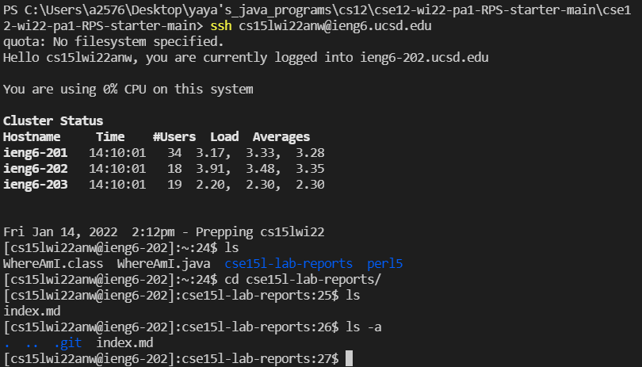
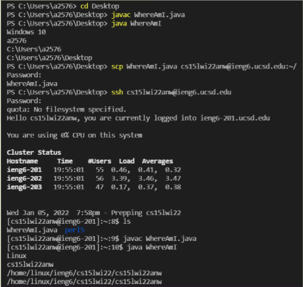
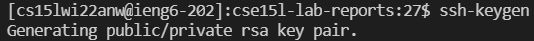
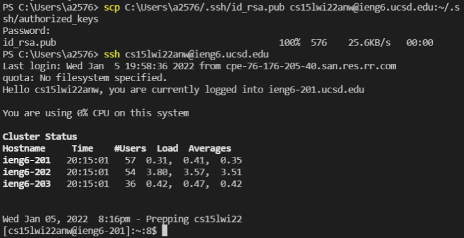
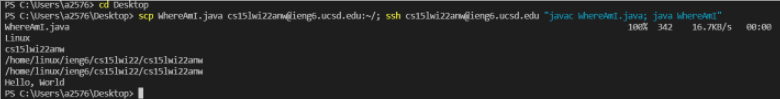

# Steps for log in to SSH

## Installing VScode

Go to the [vscode website](https://code.visualstudio.com/) and download the version corresponding to the computer system.

Here is a picture of what it looks like inside.

## Remotely Connecting

After downloading, open a new terminal in the upper tab where it shows **Terminal**.
Put the account after ssh and correctly put password in the terminal, then you will get the messages shown as the picture.

## Trying Some Commands

Some basic commands are `cd`(change directory), `ls`(list), `ls -a`(list all), `scp`(secure copy), `cat`... Try to be familiar with those. We can also use man to look up the manual if we need more information.

## Moving Files with scp

scp: secure copy the local file to the remote server
can see the file(WhereAmI.java) has been successfully moved to cs15lwi22 by using the `ls` command.

## Setting an SSH Key

By Using `ssh-keygen` command to set the SSH key, we will get private key and public key. Then we copy the public key to the .ssh directory in our computer. By doing this, we will log in to the server without putting our password. Here is the picture of the result.

## Optimizing Remote Running

keystroke： Press arrow key to go to previous commands

            Use tab to auto fill in.

"" - run it on the remote server and then exit

; - can run multiple commands

Therefore, by the command scp, it securly copies the file to the remote server, and by the command ssh and commands within the double quotes, the server compiles and runs the java file. After excuting all the commands, it exits immediately. Thus, with one line of code, we can make the changes we want in the remote serve, which can save our time and improves the efficiency.

