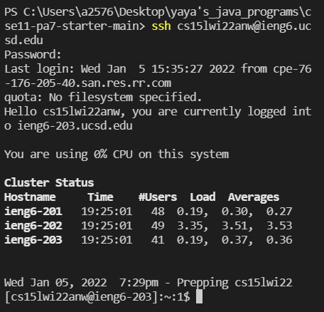

# Steps for log in to ssh

- Installing VScode

Go to the vscode website and download the version corresponding to the computer system.

Here is the inside look of vscode.

- Remotely Connecting

After downloading, open a new terminal in the upper tab where it shows **Terminal**.
Put the account after ssh and correctly put password in the terminal, then you will get the messages shown as the picture.

- Trying Some Commands

Some basic commands are cd, ls, ls -a,scp, cat... Try to be familiar with those.

- Moving Files with scp

scp: secure copy the file to the remote server
can see the file has been successfully moved by the ls command.

- Setting an SSH Key
By Using ssh-keygen command to set the SSH key, we will get private key and public key. Then we copy the public key to the .ssh directory in our computer. By doing this, we will log in to the server without putting our password. Here is the picture of the result.

- Optimizing Remote Running

"" - run it on the remote server and then exit

; - can run multiple commands

Therefore, by scp first, it securly copies the file to the remote server, and by ssh secondly, it compiles it and exits it immediately.

