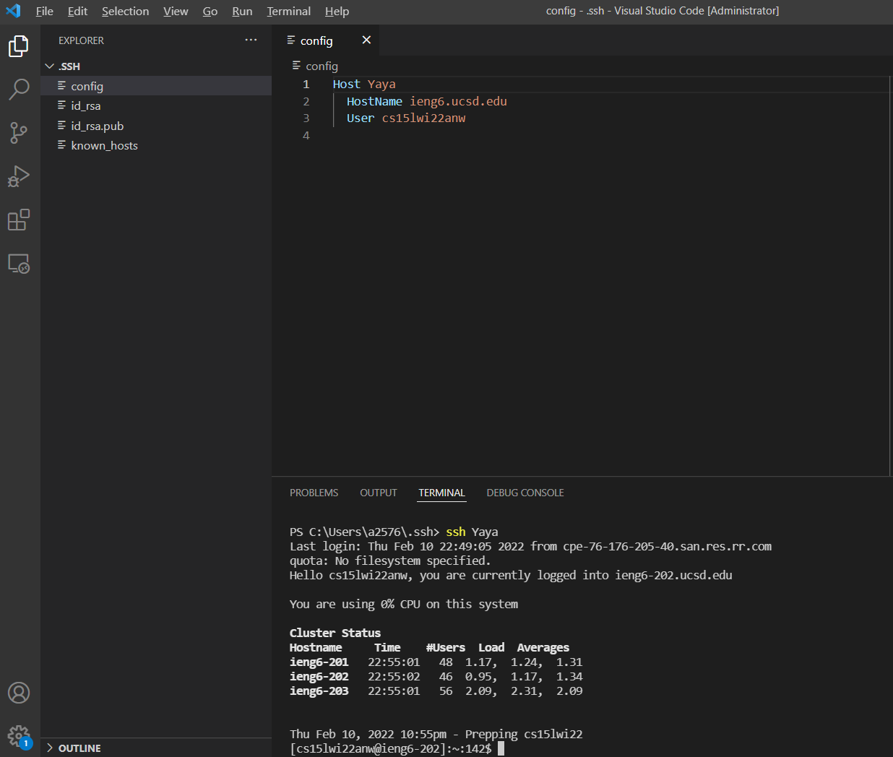

# Streamline `ssh` Configuration

## Log in
When we log in to `ieng6` from the laptop, something like this will show up. In this time, we have to type the user name, which is long and easily forgotten.

## Configuration
If we change something in the configuration file `~/.ssh/config` in the computer (create one if it does not exit), then we can log in faster with shorter command.

The config file should be in the `username/.ssh` folder.

If we use `ssh + host name`, which is `ssh ieng6` command, it allows us log in faster. It should look something like this below.

## Alias for host `ssh hostname`
Additionally, we can change the name after `Host` to change whatever name we like in order to log in next time. Therefore, the command will change from `ssh ieng6` to `ssh xxxx`. An example that I give here is `ssh Yaya`.

## Copy a file from a local system to the server `scp host:file path`

Using `scp` command to copy a file. Firstly, add the file name, which is the java file is this case. Then add the remote server user name, which is Yaya, and **:** and the file path, which is root. Therefore, the whole command is `scp MarkdownParse.java Yaya:~\`.

