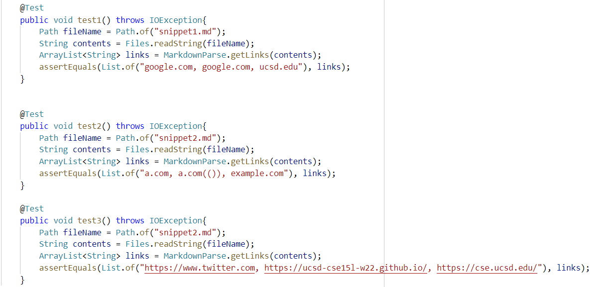
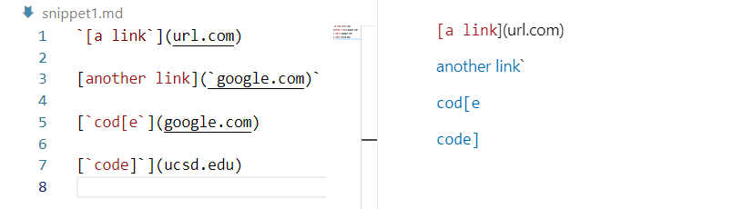
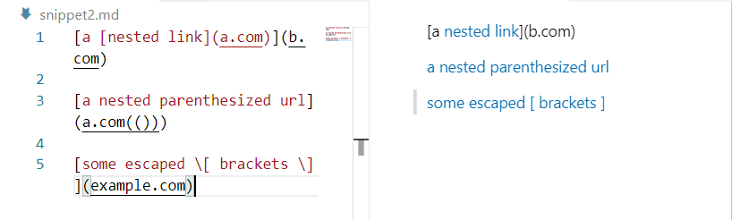
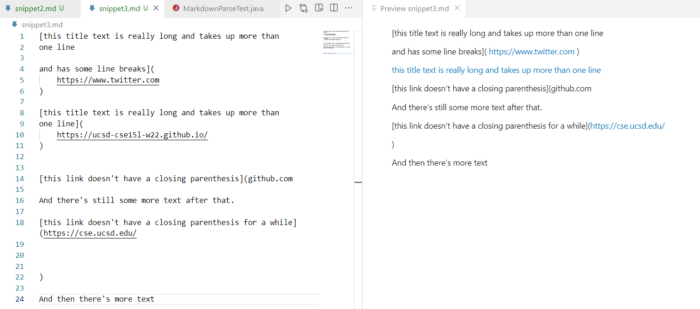
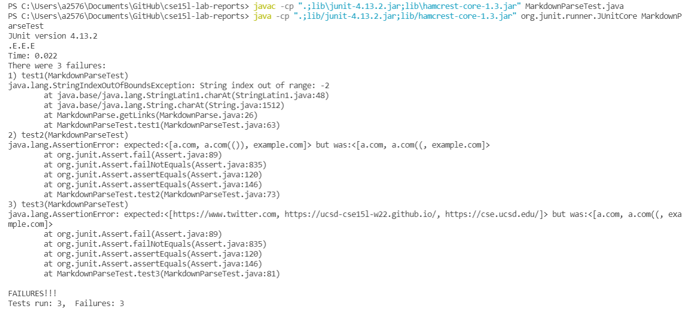
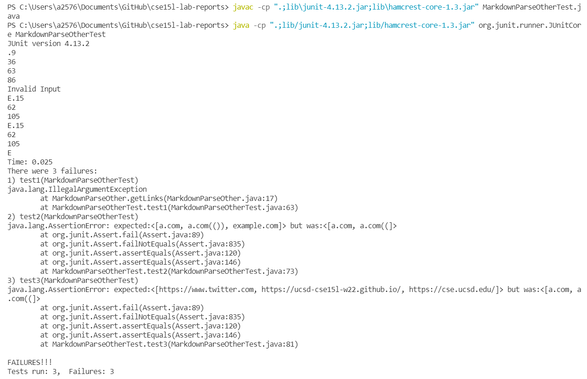

# Markdown Tests

## repo links
[This is the link to markdown-parse repository.](https://github.com/yayajjiang/markdown_inperson)

[This is the link to the one reviewed.](https://github.com/5ean-github/markdown-parse)

The tests that I wrote for the java file in the test method for turning them into a test:

## Test1:
Expected result:

## Test2:
Expected result:

## Test3:
Expected result:

## outputs
Excepted output for my code:

The other one gets:

## Feedback
1. Do you think there is a small (<10 lines) code change that will make your program work for snippet 1 and all related cases that use inline code with backticks? If yes, describe the code change. If not, describe why it would be a more involved change.

For snippet1:
Yes, it is easy. Although there are backticks` inside the brackets. We are only looking at characters inside the parentheses and turn whatever is inside to the links. We can check if there are not two backticks in the brackets, then the link is not valid, otherwise, ignore the effects that backticks bring.

2. Do you think there is a small (<10 lines) code change that will make your program work for snippet 2 and all related cases that nest parentheses, brackets, and escaped brackets? If yes, describe the code change. If not, describe why it would be a more involved change.

For snippet2:
No, because it contains a nested parentheses. It will be fairly hard to diagnoise the second () inside a link within ten lines of code.

3. Do you think there is a small (<10 lines) code change that will make your program work for snippet 3 and all related cases that have newlines in brackets and parentheses? If yes, describe the code change. If not, describe why it would be a more involved change.

For snippet3:
Yes, we can trim all the blank spaces inside the parentheses, and then we can get the link without blank. It will be easy to implement this function within ten lines of code.

