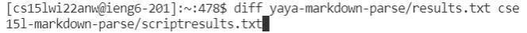
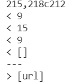
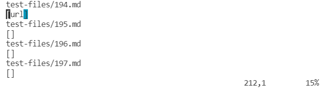
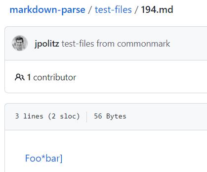
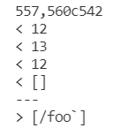
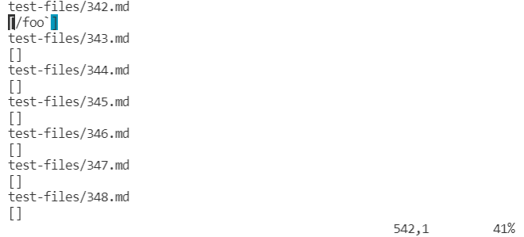
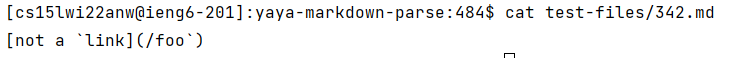

## Differences in different bugs

Two tests from the 652 commonmark-spec tests where my file had different answers than the implementation provided for lab 9. 

Compare:
I used the command `diff` to compare two files and get the differents in a stylize format, and I do not have to compare the files line by line mannualy by myself. 

# First example:

This means that on line 218 of the results.txt in the yaya-markdown-parse directory, the line contained 9 15 9 [], while on line 212 of the cse15l-markdown-parse/scriptresults.txt directory, the line contained [url]. 

Let us see the 194.md then. 

None of the output is correct, the expected output is [].

# Second example.

This means that on line 560 of the results.txt in the yaya-markdown-parse directory, the line contained 12 13 12 [], while on line 542 of the cse15l-markdown-parse/scriptresults.txt directory, the line contained [/foo`]. 

From the picutre above, we can see that it is the output for the file 342.md in test-files.

Let us see the 342.md then.

None of the output is correct, the expected output is [/foo].

## problems
What is wrong with the code?
Take my code for example, it is also printing the extra indexes which is not needed. We can get rid of that first.
Also, it does not c heck the extra parenthesis. We need to fix that by checking the extra  in the code.