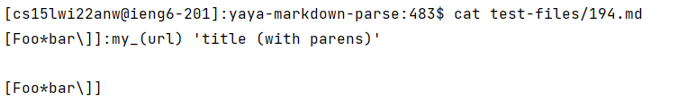

## Differences in different bugs

Two tests from the 652 commonmark-spec tests where my file had different answers than the implementation provided for lab 9. 

Compare:
I used the command `diff` to compare two files and get the differences in a stylized format, and I do not have to compare the files line by line manually by myself. 

# First example:

This means that on line 218 of the results.txt in the yaya-markdown-parse directory, the line contained 9 15 9 [], while on line 212 of the cse15l-markdown-parse/scriptresults.txt directory, the line contained [url]. 

Let us see the 194.md then. 

My output is correct, the expected output is [url].

# Second example.

This means that on line 560 of the results.txt in the yaya-markdown-parse directory, the line contained 12 13 12 [], while on line 542 of the cse15l-markdown-parse/scriptresults.txt directory, the line contained [/foo`]. 

From the picture above, we can see that it is the output for the file 342.md in test-files.

Let us see the 342.md then.

None of the output is correct, the expected output is [].

## problems

What is wrong with the code?
My code is wrong for both examples. Take my code for example, I also print out the extra indexes which is not needed. I can get rid of those first so that my code is correct for the first test.
The solution is to comment out those println statements.

For the second test, I do not think about the influence from the ``. It does not check the `code block` like this. We need to fix that by checking the ` in the code. We can put the code in the if conditional statements.

